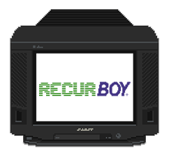

# recurBOY
a pi0 video-instrument designed for diy soldering workshops

## goal

to design a 'lite' version of r_e_c_u_r (raspberry pi based video-sampler) that can be built from a kit in a group workshop for around 30euro per unit

## hardware WIP-BOM

REF | NAME | NUMBER | APROX COST 
--- | --- | --- | ---
na | [raspberry pi zero] | 1 | 5
na | custom pcb 100x100mm | 1 | 1.8
na | [1.8" screen] | 1 | 3.5
na | [push buttons + caps from china] | 6 | 1 
na | 10k linear pots | 4 | 3
na | [thonkicon jack] inputs | 4 | 1.5
na | [mcp3008 a2d dip] | 1 | 2
na | 1kohm resistors | 4 | 2
na | bat85 diodes| 8 | 2
na | 2x20 pin header | 1 in 1 out | 0.5
na | [composite video jack] | 1 | 1
na | [sd card 8gb] | 1 | 2 |
na | power-adapter | 1 |  5
na | (optional) [raspi camera clone] | 1 | 7
na | [5-way push button] | 1 | 1.5

__estimate total : ~ 28 + (optional 7 camera)__
(this includes postage on most things / assumes free for mouser etc ...)

## features

video-sampler and synthesizer : 

### 3 input modes:

- `sampler` : play videos from sd or usb - seamless ? how much control over player tbc - ie seeking, setting start/end points , seamless or not ? havnt quite decided on this yet
- `shader` : running frag-shaders from sd or usb - param inputs from 4 knobs and 4 cv in
- `camera` : live input from piCamera - can preview and record

plus `fx` mode:

- any of the 3 inputs can be piped through an _fx_ shader.

## software

my idea is for the code to run (mostly) completely in openframeworks. video-playing / shader-effects / capture input all are already running in my _ofxVideoArtTools_ repo. writing to the display is much easier in python so will push updates from OF to a python script via OSC , also sample-processing might also be done here ? lets see.

## layout idea

### initial brainstorm

### revision0.1

...

[raspberry pi zero]: https://www.berrybase.de/raspberry-pi-zero-v1.3
[1.8" screen]: https://www.aliexpress.com/item/32996979276.html
[mcp3008 a2d dip]: https://www.aliexpress.com/item/32735896933.html
[push buttons + caps from china]: https://www.aliexpress.com/item/32826994795.html
[thonkicon jack]: https://modularaddict.com/pj301m12-jacks
[sd card 8gb]: https://www.aliexpress.com/item/33040093922.html
[composite video jack]: https://www.mouser.de/ProductDetail/CUI/RCJ-024?qs=%2Fha2pyFadujC6XIlhTY7nF4RUCR%2FYibjfCLz8sPuiKglF9KHFnEXMg%3D%3D
[raspi camera clone]: https://www.aliexpress.com/item/32825264717.html
[5-way push button]: https://www.aliexpress.com/item/32845147449.html

