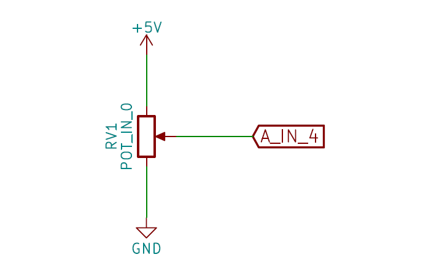
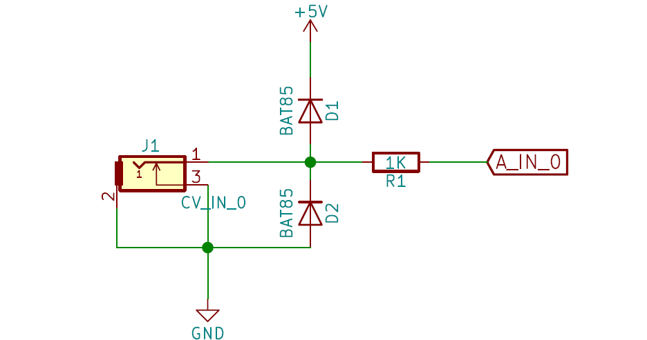

# recurBOY

__recurBOY__ is a raspberry pi zero based diy video-instrument for live performance.

### motivation

it was designed to be built together with others in group workshop sessions.

for many people there is a barrier to enter the world of hardware video-art making instruments - both due to the general higher cost of video gear compared with audio equipment and in some cases its obsolescence and thus rarity.

this project aims to remove these financial barriers while enabling anyone interested to build their own art-making tools. by creating together we can learn from each other and help foster community in a physical space.

### features

- outputs composite video

- 2 source modes : _sampler_ and _shaders_
- process any source with additional _FX_
- control shader/fx parameters directly with 4x knobs or externally with 4x cv inputs

## build guide

familiarize yourself with the basics of soldering and the parts we will be using:

ref | part
--- | ---
R1, R2, R3, R4 | 1k resistors
D1, D2, D3, D4, D5, D6, D7, D8 | bat85 diodes
J8 | Raspberry_Pi / 2x20 pin socket
J6 | Raspberry_Pi_TV_out
U1 | MCP3208 IC
J9 | 5-way push buton
SW1, SW2, SW3, SW4, SW5 | push buttons
J1, J2, J3, J4 | 3.5mm jacks
J7 | rca socket
RV1, RV2, RV3, RV4 | 10k potentiometers
J5 | 1.8" TFT display

__R1-4, D1-8__ : start by placing the resistors and diodes. it is __important__ that the _diodes_ are placed in the correct direction ! for resistors it does not matter.

__J8, J6__ : there are two parts that need to be placed __from the bottom__ . this is so the raspberry pi can be attached underneath. turn the board over and find j8 - the 2x20 pin socket will connect to the pi0 gpio pins. it is __very important__ that these are soldered on straight. start by soldering 1 or 2 pins from the header and then check it is perpendicular to the board - once multiple pins are soldered it is very difficult to correct the angle. next to this is j6 - a single pin socket that will connect to the pi0 tv out.

__U1, SW1-5, J9__ : flip back to the front. now you can solder the ic ans buttons. use the ic socket if you like. also try to make sure the 5-way button is straight before soldering all the pins

__J5__ : for screen make sure the included 8x1 pin header is soldered to the screen first - with short pin end to the screen. then you can solder the screen - with long header pin ends through the recurBOY pcb.

__J1-4, J7__ : next is the top row of jacks

__RV1-4,__  : now you can solder the potentiometers.

if not already you will need to also solder the gpio-header to the raspberry pi and a single pin for the tv-out - then this should slot into the bottom of the pcb.

## operation guide

check that the raspberry pi is attached to the recurBOY pcb and the flashed micro-sd is inserted.

connect recurBOY to a tv via the rca jack in the top middle. now plug the micro-usb power supply into the raspberry pi power-jack - take care it is the power jack and not the usb.

you should see the display light up and recurBOY splash on the connected tv. wait a few moments for the pi to boot - the display should show a menu when ready.

### source selection

__recurBOY__ has 2 source modes : _sampler_ , _shaders_. pressing the `MODE` button will cycle through these modes.

you can tell which mode is selected by looking at the title and colour of the display.

### sampler

the nav_button can be pressed `UP` , `DOWN` , `LEFT`, `RIGHT` and `IN`. we will not use the `IN` button for now.

pressing `UP` and `DOWN` lets you scroll through the list of samples. this list comes from the `~/Videos` folder on the pi's SD card and the `/Videos` folder on top level of an attached usb-drive. any .mp4, .mkv, .avi or .mov file will be shown although it is not guarenteed it will work with the player - we find h264 mp4 to be most reliable.

pressing `SELECT` on a sample will start playing it. the playing sample will be highlighed on the display

### shaders

in exactly the same way as in _samples_ from this source mode you can navigate through and select a shader file to run. this list is compiled from the `~/Shaders` folder on the pi and any .frag, .shader, .glsl, .glslf,or .fsh file in the `/Shaders` folder on top level of an attached device.

while the display is in __SHADER__ mode you can use the 4 knobs or CV inputs to manipulate the shader parameters. each shader has parameters 1-3 mapped to different values. parameter 4 always controls the speed.

### FX

from any source mode you can press the `RIGHT` nav_button to enter _fx_ mode. you can see this on the title of the display. same as elsewhere an _fx_ can be selected with `UP`, `DOWN` and `SELECT`. pressing `LEFT` will return to the selected _source mode_. these are read from `~/Fx` folder on the pi and `/Fx` folder on top level of attached usb drive.

pressing the `FX` button will toggle the selected _fx_ on and off. this _fx_ will process whichever of the sources is selected.

the 4 knobs / cv inputs will control parameters of the _fx_ when _source_ shader mode is not selected.

## how the circuit works

### raspberry pi

a raspberry pi is a small computer - often referred to as a _Single Board Computer_ or SBC. it has 40 pins on it called _GPIOs_ - General Purpose In Out - which can be used to connect it with other components. the GPIO pins on the raspberry pi are _digital_ - this means that at any given time they can only be read as HIGH - 1 or LOW - 0. nothing in between. it also has a pin called `tv out` for outputting composite video.

### reading button presses

we can use some of these GPIO pins on the raspberry pi to know when a button is pressed. one side of the button is connected to the pin and the other is connected to ground. on the raspberry pi we tell these pins to _pull up_. this means they are HIGH by default.

when the button is pressed however the circuit connecting the pin to ground is completed and the pin becomes LOW. in the code we ask the state of a GPIO pin and if LOW we know the button is pressed.

### reading continuous inputs

_digital pins_ - HIGH/LOW are good for discrete inputs like button presses which can only be OFF/ON. however we also want to have continuous inputs for example from knobs which can be set to any amount _between_ LOW and HIGH. this kind of input is called _analog_ - the reading is analogous to the voltage on the pin. 

since raspberry pi has no _analog_ GPIO pins we need to introduce a new ic - the __MCP3008__. this type of ic is called an _analog to digital converter_ or a2d for short. it has 8 _analog_ pins which read the voltage applied to them and converts it to digital information. this information can be understood by the raspberry pi's _digital_ pins. in this case using a digital protocol called SPI)

four of the MCP3008 channels are connected to potentiometers which in this circuit act as voltage dividers. one side of the pot is connected to +5V and the other to GND. the output is always some voltage between these.
after passing through the a2d this voltage value between GND and +5V is converted to a number between 0 and 1024.

the other four MCP3008 channels are connected to 3.5mm jacks. this allows the voltage to be set by external devices - this kind of interaction between instruments is called _Control Voltage_ or CV. each of the CV inputs also use a resistor and two diodes - these are to protect the IC from incoming voltages above +5V or below GND

### the display

the raspberry pi also connects to the display screen with GPIO pins - this time the pins are used as _outputs_ , telling the screen which pixels to colour - again the protocol used here is SPI - but we dont need to worry about how exactly this works - there is a python library that is used to describe what the screen should show.    

## extra information

### origin

the _recurBOY_ is a spinoff from an existing project tim has created and maintains - __r_e_c_u_r__ : _an open diy video sampler_ ; r_e_c_u_r is simple to assemble but can be more complex to operate due to its scope and customisablity. recurBOY distills the best parts, aiming to be simpler and more beginner friendly. it uses cheaper parts and runs on a raspberry pi zero which can be a fraction the price of the pi3 used in r_e_c_u_r. 

if you like this device and want more features you can try building a r_e_c_u_r also - checkout the github or video guides online.

### some technical details

the recurBOY application is built in __openframeworks__ - a collection of open-source c++ libraries for creative coding. in particular it uses _ofxVideoArtTools_ - an abstraction of openframeworks libraries and extensions into modules specifically for making video instruments on raspberry pi.

the pcb was designed in KiCad.

### shaders

shaders are small text files of code that tell a graphics card what to draw. they use a language called _glsl_ to communicate what colour a pixel should be and where. you don't have to understand every line to begin playing around with them. 

thanks to Erogenous Tones - a modular synth company who have a mature and very powerful shader-playing video instrument called STRUCTURE , we now also have a web-based environment for browsing, modifying and creating shaders to perform with.

go to glsl.erogenous-tones.com - if you select any example you will see the code used to create the patch. try changing some of the numbers - modifying the input parameters is especially interesting. when you are happy with the results select the `save as .glsl file` . now copy this file onto your USB in the correct folder -` /Shaders` and connect to recurBOY

for more information on understanding and writing shaders yourself check out _the book of shaders by Gonzalez Vivo_.

### bonus feature

~~camera~~ -> usb-capture

i expected to be able to use live input from raspberry pi camera with this instrument however the pi0 could not handle opening the camera in openframeworks. somewhat unexpectedly however the usb-capture i tried seemed to work for previewing - it was glitchy but usable (recording was too much though). feel free to try this bonus feature if you like. if you want to use recurBOY with a pi3 you can enable the camera / recording too !

to use live input from a raspberry pi camera first ensure it is attached correctly. if a camera is attached the _camera_ source will be available by pressing `MODE`. from here pressing `SELECT` will start showing the camera _preview_. ~~when previewing it is possible to press `SELECT` again to start and stop camera _record_. after recording has stopped it will be converted to h264 mp4 and saved in `~/Videos` to be launched in _sampler_ mode.~~

